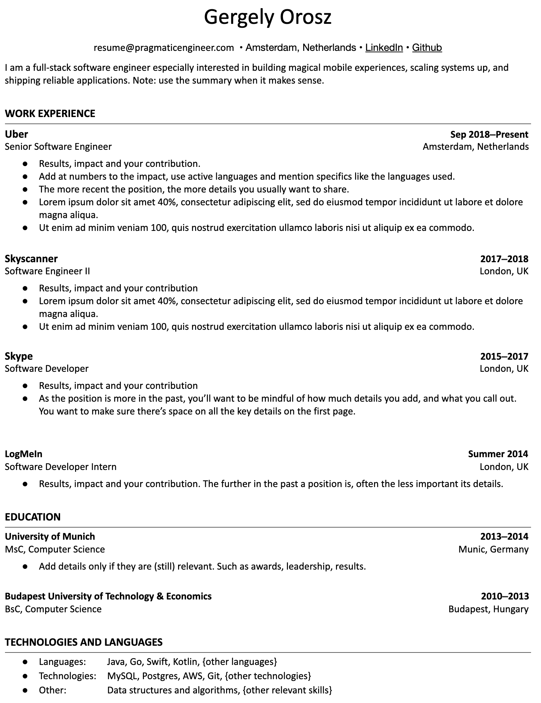
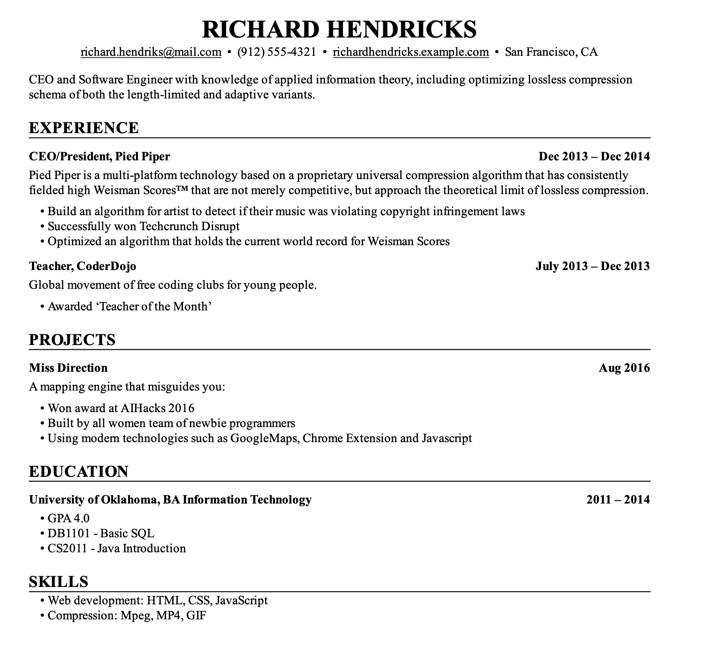
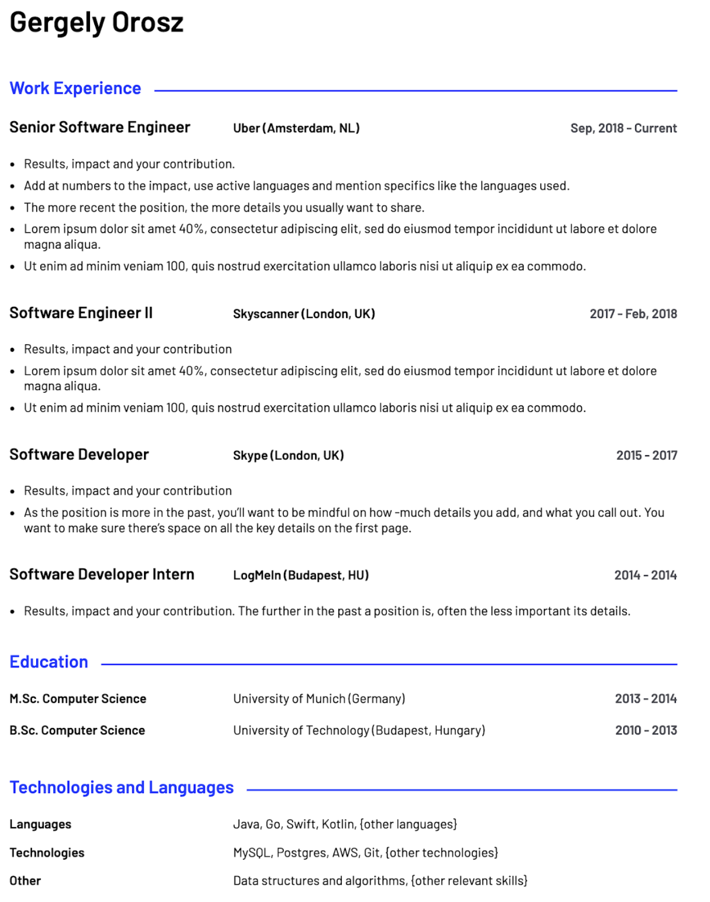
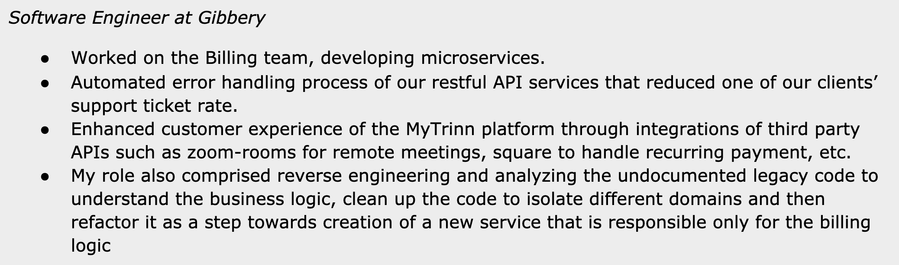

# Resume Builder - Feature Extension Guide

> Comprehensive specification for building a Resume Builder extension for a Next.js 16 application.
> Based on analysis of Gergely Orosz's ByteByteGo Tech Resume Course (19 chapters, 78K+ words, 110 images).

---

## Table of Contents

1. [Product Overview](#1-product-overview)
2. [Core Principles](#2-core-principles)
3. [Data Model](#3-data-model)
4. [Resume Sections Specification](#4-resume-sections-specification)
5. [Experience Level Profiles](#5-experience-level-profiles)
6. [Career Path Variations](#6-career-path-variations)
7. [Content Rules Engine](#7-content-rules-engine)
8. [Bullet Point Formulas](#8-bullet-point-formulas)
9. [Validation Rules](#9-validation-rules)
10. [Template System](#10-template-system)
11. [Template Catalog](#11-template-catalog)
12. [Typography & Formatting Spec](#12-typography--formatting-spec)
13. [Before/After Transformation Rules](#13-beforeafter-transformation-rules)
14. [AI-Powered Features](#14-ai-powered-features)
15. [Companion Features](#15-companion-features)
16. [Technical Architecture](#16-technical-architecture)
17. [UI/UX Feature Requirements](#17-uiux-feature-requirements)
18. [Image Reference Guide](#18-image-reference-guide)

---

## 1. Product Overview

### What We're Building

A Resume Builder extension integrated into an existing Next.js 16 application. The builder helps tech professionals create ATS-friendly, recruiter-optimized resumes based on expert guidelines from Gergely Orosz (The Pragmatic Engineer).

### Key Differentiators

- **Expert-backed rules engine** - every suggestion is grounded in hiring manager insights
- **Experience-level-aware** - adapts section order, content guidance, and templates per career stage
- **ATS-optimized output** - PDF-first, text-based, single-column-preferred
- **AI-assisted content improvement** - bullet point rewriting, metric extraction, cliche detection
- **Multi-resume management** - master resume + tailored versions per job application

### Target Users

- Software engineers (junior through staff+)
- Bootcamp graduates and career changers
- Tech leads and engineering managers
- New graduates and interns

---

## 2. Core Principles

These principles should guide every design and implementation decision:

| # | Principle | Implication |
|---|-----------|-------------|
| 1 | **Resume's only goal is to get an interview** | It's a sales document, not a life history. Guide users toward brevity and impact. |
| 2 | **7-second scan rule** | Recruiters scan in ~7 seconds. The design must surface key info (title, skills, company) instantly. |
| 3 | **Tailoring is mandatory** | Support creating multiple resume versions from a master. Each version targets a specific role. |
| 4 | **Show impact, not responsibilities** | Every bullet point should follow the accomplishment formula. The UI must guide this. |
| 5 | **Career progression matters** | The resume must tell a story of growth. Highlight promotions and increasing scope. |
| 6 | **PDF is the only output format** | Never output .doc or .rtf. PDF preserves formatting across all viewers. |
| 7 | **ATS is organizational, not a gatekeeper** | Don't build "ATS bypass" features. Build for human readability; ATS handles the rest. |
| 8 | **No bias-inducing content** | Never include photo upload, date of birth, gender, nationality, marital status, or religion fields. |
| 9 | **Single-column layouts are superior** | For tech resumes, single-column supports natural top-to-bottom scanning. |
| 10 | **Referrals trump everything** | A referral bypasses the initial scan. The builder doesn't control this, but could integrate referral tracking. |

---

## 3. Data Model

### Entity Relationship

```
User (1) ──── (N) Resume
                    ├── (1) ContactInfo
                    ├── (1) Summary
                    ├── (N) WorkExperience
                    │         └── (N) Achievement
                    ├── (N) Education
                    ├── (N) SkillCategory
                    │         └── (N) Skill
                    ├── (N) Project
                    │         └── (N) Achievement
                    ├── (N) Certification
                    ├── (N) Extracurricular
                    └── (1) ResumeSettings
```

### Schema

```typescript
// User can have multiple resumes (master + tailored versions)
interface Resume {
  id: string;
  userId: string;
  title: string;                    // e.g., "Senior Backend Engineer - Google Application"
  templateId: string;               // Reference to template
  experienceLevel: ExperienceLevel; // Drives section ordering and guidance
  targetRole?: string;              // e.g., "Frontend", "Backend", "Staff+"
  isMaster: boolean;                // Is this the master resume?
  parentResumeId?: string;          // If tailored, link to master
  settings: ResumeSettings;
  createdAt: Date;
  updatedAt: Date;
}

type ExperienceLevel =
  | "intern"
  | "new_grad"
  | "bootcamp_grad"
  | "junior"        // 1-3 years
  | "mid"           // 3-5 years
  | "senior"        // 5-10 years
  | "staff_plus"    // 10+ years
  | "tech_lead"
  | "eng_manager";

interface ContactInfo {
  id: string;
  resumeId: string;
  fullName: string;
  email: string;
  phone?: string;
  city: string;
  country: string;
  linkedinUrl?: string;
  githubUrl?: string;
  portfolioUrl?: string;
  blogUrl?: string;
}

interface Summary {
  id: string;
  resumeId: string;
  text: string;          // 1-3 sentences max
  isVisible: boolean;    // Some profiles should hide this
}

interface WorkExperience {
  id: string;
  resumeId: string;
  jobTitle: string;
  company: string;
  location: string;
  startDate: Date;
  endDate?: Date;        // null = "Present"
  isPromotion: boolean;  // Visual indicator of career growth
  parentExperienceId?: string; // For promotions within same company
  order: number;
  achievements: Achievement[];
}

interface Achievement {
  id: string;
  parentId: string;      // WorkExperience or Project ID
  parentType: "work" | "project";
  text: string;          // Single bullet point
  hasMetric: boolean;    // Computed: does this contain a number?
  order: number;
}

interface Education {
  id: string;
  resumeId: string;
  degree: string;
  institution: string;
  fieldOfStudy?: string;
  graduationDate: Date;
  gpa?: number;          // Only show if > 3.5 and < 5 years experience
  relevantCoursework?: string[];
  honors?: string;
  order: number;
}

interface SkillCategory {
  id: string;
  resumeId: string;
  name: string;          // e.g., "Languages", "Frameworks", "Databases", "Cloud", "Tools"
  skills: string[];      // e.g., ["TypeScript", "Python", "Go"]
  order: number;
}

interface Project {
  id: string;
  resumeId: string;
  name: string;
  projectUrl?: string;
  sourceUrl?: string;    // GitHub link
  description: string;
  achievements: Achievement[];
  order: number;
}

interface Certification {
  id: string;
  resumeId: string;
  name: string;
  issuer: string;
  date: Date;
  order: number;
}

interface Extracurricular {
  id: string;
  resumeId: string;
  type: "patent" | "publication" | "talk" | "open_source" | "community" | "other";
  title: string;
  description?: string;
  url?: string;
  order: number;
}

interface ResumeSettings {
  id: string;
  resumeId: string;
  templateId: string;
  accentColor: string;           // Hex color for links/headers
  fontFamily: FontFamily;
  fontSize: "compact" | "comfortable" | "spacious";
  dateFormat: "full" | "month_year" | "year_only";
  sectionOrder: string[];        // Array of section IDs in display order
  hiddenSections: string[];      // Section IDs to hide
  pageLimit: 1 | 2 | 3;
}

type FontFamily =
  | "inter"        // Modern sans-serif
  | "source_sans"  // Clean sans-serif
  | "lato"         // Friendly sans-serif
  | "georgia"      // Classic serif
  | "garamond"     // Elegant serif
  | "source_code"  // Monospace (for Mono template)
  ;
```

---

## 4. Resume Sections Specification

### Section Inventory

| Section | Status | Fields | Notes |
|---------|--------|--------|-------|
| **Contact Details** | Required | name, email, phone, city, country, linkedin, github, portfolio | Max 4 links |
| **Summary** | Conditional | text (1-3 sentences) | Required for senior/manager/career-change. Hidden for juniors. |
| **Work Experience** | Required | title, company, location, dates, 3-4 achievement bullets each | Most critical section for experienced professionals |
| **Education** | Required | degree, institution, field, graduation date, GPA (conditional), coursework (conditional) | Prominence decreases with experience |
| **Skills / Technologies** | Required | Categorized skill lists (Languages, Frameworks, DBs, Cloud, Tools) | No ratings. Order by relevance. |
| **Projects** | Recommended | name, URLs, description, achievements | Critical for new grads; optional for experienced |
| **Certifications** | Optional | name, issuer, date | More valued by agencies and non-tech-first companies |
| **Extracurricular** | Optional | type, title, description, URL | Patents, publications, talks, OSS |
| **Interests** | Optional | One-line list | First thing to cut for space |

### Sections to NEVER Include

| Excluded | Reason |
|----------|--------|
| Objective Statement | Outdated; states the obvious |
| Photo | Introduces unconscious bias |
| Date of Birth | Introduces age bias |
| Gender / Nationality / Marital Status | Irrelevant; introduces bias |
| References / "Available on Request" | Assumed; wastes space |
| Self-rated skills (stars, bars, percentages) | Subjective and counterproductive |
| Third-party quotes / testimonials | Inappropriate for resumes |
| Full mailing address | Privacy concern; city+country suffices |

---

## 5. Experience Level Profiles

The builder should ask users their experience level upfront and use it to configure defaults.

### Intern / New Grad

```
Default Section Order:
1. Contact Details
2. Education (emphasized: GPA if > 3.5, coursework, awards)
3. Internship Experience
4. Projects (critical)
5. Skills / Technologies
6. Extracurricular / Leadership
7. Interests (optional)

Page Limit: 1 page (strict)
Summary: Hidden by default
```

**Guidance:**
- Education goes near the top
- Include GPA if > 3.5
- Include relevant coursework (Data Structures, Algorithms)
- Projects must have GitHub links with quality READMEs
- Treat internships like professional experience with impact bullets

### Bootcamp Grad / Career Changer

```
Default Section Order:
1. Contact Details
2. Summary (mandatory: explain career change motivation)
3. Skills / Technologies (prominent)
4. Projects (most important section)
5. Work Experience (concise: 1 sentence + 1 transferable-skill bullet per role)
6. Education
7. Certifications

Page Limit: 1 page (strict)
```

**Guidance:**
- Summary is mandatory to frame the career narrative
- Projects should include live hosted demos, OSS contributions, freelance work
- Past experience kept very concise; focus on transferable skills
- Prompt: "What skills from your previous career apply to tech?"

### Mid-Level Professional (2-5 years)

```
Default Section Order:
1. Contact Details
2. Summary (optional)
3. Work Experience (primary section)
4. Skills / Technologies (must be on page 1)
5. Projects (only if significant)
6. Education (minimal: degree + institution + year)
7. Certifications (optional)

Page Limit: 1-2 pages
```

**Guidance:**
- Remove GPA (unless extraordinary)
- Remove coursework and activities
- Work experience is the star; 3-4 achievement bullets per role
- Skills must be on first page for easy scanning

### Senior Professional (5-10+ years)

```
Default Section Order:
1. Contact Details
2. Summary (recommended: frame career narrative)
3. Work Experience (focus on impact + mentorship + influence)
4. Extracurricular (patents, publications, OSS gain importance)
5. Skills / Technologies
6. Education (end of resume, minimal)

Page Limit: 2 pages
```

**Guidance:**
- Early career roles should be highly condensed (title, company, dates only)
- Include "soft" achievements: mentoring, team building, process improvement
- Highlight cross-team influence and technical leadership

### Staff+ Engineer

```
Builds on Senior profile with emphasis on:
- Cross-team and organizational influence
- Setting technical direction and architecture
- Mentoring senior engineers
- Strategic decision-making impact

Page Limit: 2 pages
```

### Tech Lead / Engineering Manager

```
Default Section Order:
1. Contact Details
2. Summary (mandatory: leadership philosophy + challenge types)
3. Work Experience
   - Tech Lead: team delivery, quality, making teams successful
   - Manager: hiring, people development, team health, shipping through the team
4. Extracurricular
5. Skills / Technologies
6. Education

Page Limit: 2 pages
```

**Guidance for Tech Lead bullets:**
- "Sped up delivery by X%"
- "Led a team of N engineers to ship..."
- Team context is essential (team size, scope)

**Guidance for Manager bullets:**
- Hiring achievements (diversity metrics)
- People development (promotions coached)
- Team health metrics (low attrition)
- Shipping impactful projects *through* the team

---

## 6. Career Path Variations

When users specify a target role, reorder content to emphasize relevant experience.

| Target Role | Prioritize | Key Metrics |
|-------------|-----------|-------------|
| **Frontend** | UI/UX, JS/TS frameworks (React, Vue, Angular), design systems | Page load time, Lighthouse scores, user engagement |
| **Backend** | Languages (Go, Java, Python), databases, APIs, distributed systems | API latency, uptime (99.9%), throughput (QPS), cost savings |
| **Mobile** | Swift, Kotlin, Flutter, React Native, app store releases | App ratings, download counts, crash rates |
| **Data / ML** | Python/R, Spark, TensorFlow, PyTorch, statistical modeling | Model accuracy, business outcome impact, data processed |
| **DevOps / Infra** | Cloud platforms, Kubernetes, CI/CD, monitoring | Deploy frequency, MTTR, infrastructure cost reduction |
| **Management** | Leadership, project delivery, people management | Team size, shipping velocity, retention, promotions |

**Rule:** When a user has experience in multiple areas, the content most relevant to the target role should be listed first within each job experience.

---

## 7. Content Rules Engine

### Writing Rules for Achievement Bullets

| Rule | Implementation |
|------|---------------|
| Start with strong action verb | Validate first word against approved verb list |
| Include at least one metric | Flag bullets without numbers |
| Max 2 lines per bullet | Character limit enforcement |
| 3-4 bullets per role | Count enforcement per work experience |
| No passive voice | Detect "was responsible for", "assisted with", "worked on" |
| No buzzwords | Detect "team player", "fast learner", "hit the ground running" |
| No internal jargon | Flag acronyms not in standard tech vocabulary |
| Show impact, not responsibility | Detect "responsible for" pattern and suggest rewrite |

### Approved Action Verbs

```
Leadership:    Led, Directed, Managed, Coordinated, Spearheaded, Championed
Creation:      Built, Designed, Architected, Developed, Implemented, Created, Launched
Improvement:   Improved, Optimized, Enhanced, Streamlined, Accelerated, Reduced
Analysis:      Analyzed, Evaluated, Assessed, Investigated, Diagnosed
Communication: Presented, Documented, Authored, Published, Mentored, Trained
```

### Verbs to Flag and Replace

| Flag | Suggest Instead |
|------|----------------|
| "Worked on" | "Built", "Implemented", "Developed" |
| "Responsible for" | "Led", "Managed", "Drove" |
| "Took part in" | "Contributed to", "Collaborated on" |
| "Assisted with" | "Supported", "Enabled" (or better: describe specific contribution) |
| "Helped" | "Enabled", "Facilitated" (or describe the specific help) |

---

## 8. Bullet Point Formulas

### The XYZ Formula (Primary)

**Structure:** `Accomplished [X] as measured by [Y] by doing [Z]`

- **X** = Impact/Result for the business or user
- **Y** = Quantifiable metric
- **Z** = Specific action or technical contribution

### Examples

**Before (Weak):**
> Worked on the Billing team, developing microservices.

**After (Strong):**
> Reduced support tickets by 80% by implementing comprehensive error code mapping in a Node.js billing API, ensuring 100% of error codes resolve to appropriate HTTP responses.

**Before (Weak):**
> Automated error handling in our RESTful API services.

**After (Strong):**
> Improved availability of the receipts microservice from 99.8% to 99.9% by implementing a Redis read-through cache layer, eliminating redundant database queries during peak traffic.

### Metrics to Prompt For

The builder should proactively ask users these questions to extract metrics:

| Question | Metric Type |
|----------|------------|
| "How many users did this serve?" | Scale |
| "By what percentage did this improve X?" | Performance gain |
| "How much revenue/cost was involved?" | Revenue / Cost savings |
| "How many team members were involved?" | Team size |
| "How much faster was it?" | Latency / Speed |
| "What was the before/after availability?" | Reliability |
| "How many teams adopted this?" | Adoption / Influence |

**Important:** Approximate numbers are better than no numbers. Guide users with: "A rough estimate is better than nothing."

---

## 9. Validation Rules

The builder should run these validations in real-time and surface warnings/errors.

### Critical (Block Export)

| Rule | Check |
|------|-------|
| No empty sections visible | All visible sections must have content |
| Contact info complete | Name + email + city/country required |
| At least one work experience or project | Resume must have substance |
| No broken URLs | Validate all entered URLs |
| File naming convention | Export as `{FirstName}_{LastName}_Resume.pdf` |

### Warnings (Show Alert)

| Rule | Check |
|------|-------|
| Bullet without metric | Flag achievement bullets containing no numbers |
| Passive language detected | Flag "worked on", "responsible for", etc. |
| Buzzword detected | Flag "team player", "fast learner", "excellent communication" |
| Internal jargon detected | Flag non-standard acronyms |
| Over page limit | Content exceeds selected page limit |
| GPA shown with 5+ years experience | Suggest removing GPA |
| Coursework shown with 5+ years experience | Suggest removing coursework |
| Skills self-rated | Prevent skill rating UI entirely |
| Too many contact links | Max 4 contact links |
| Large text blocks | Flag paragraphs > 3-4 lines; suggest bullet points |
| Inconsistent date format | Ensure all dates use same format |
| Missing location in work experience | Prompt to add city/country |
| Too many bullets per role | Warn if > 5 bullets per role |
| Too few bullets per role | Warn if < 2 bullets per role |
| Sloppy language | Flag "etc.", "and so on", slang |
| Photo detected | Never allow photo upload |

### Style Enforcement

| Rule | Check |
|------|-------|
| Font size minimum | Never allow below 9pt |
| Consistent formatting | Enforce single font family throughout |
| Bold usage | Flag bolding within body sentences (only titles, companies, dates) |
| Link styling | All URLs must be clickable; styled to match text color (no default blue) |
| No sub-bullets | Prevent nested bullet points |

---

## 10. Template System

### Architecture

Decouple content from presentation completely:

```
Resume Data (JSON) ──→ Template Engine ──→ HTML/CSS ──→ PDF
                         │
                         ├── Template A (Pragmatic)
                         ├── Template B (Parker)
                         ├── Template C (Mono)
                         └── Template D (Smarkdown)
```

**Key design decisions:**
- Content entered once, rendered in any template
- Users can switch templates without re-entering data
- Templates enforce good spacing (prevent content cramming)
- All templates must support `@media print` styles
- PDF generation via headless browser (Puppeteer) on the server

### Template Properties

```typescript
interface ResumeTemplate {
  id: string;
  name: string;
  description: string;
  category: "recommended" | "classic" | "creative" | "minimal";
  layout: "single_column" | "two_column";
  targetExperienceLevels: ExperienceLevel[];
  maxPages: number;
  previewImageUrl: string;

  // Design tokens
  tokens: {
    fontFamily: {
      heading: string;
      body: string;
    };
    fontSize: {
      name: string;       // e.g., "28px"
      sectionHeader: string;
      jobTitle: string;
      body: string;
      date: string;
    };
    spacing: {
      sectionGap: string;
      entryGap: string;
      lineHeight: string;
      pageMargin: string;
    };
    colors: {
      primary: string;     // Text color
      secondary: string;   // Dates, location
      accent: string;      // Links, headers
      background: string;
      divider: string;
    };
    layout: {
      columnRatio?: string; // e.g., "30/70" for two-column
      headerStyle: "centered" | "left_aligned" | "full_width";
      sectionDivider: "line" | "space" | "border" | "none";
    };
  };
}
```

### Customization Options

| Option | Type | Constraints |
|--------|------|------------|
| Accent color | Color picker | Single color for links + headers |
| Font family | Select (curated list) | 6 font pairings max |
| Density | Toggle: compact / comfortable / spacious | Maps to font size + spacing presets |
| Section order | Drag-and-drop | Reorder all sections |
| Section visibility | Toggle per section | Show/hide optional sections |
| Custom sections | Text input | User-defined section names |
| Date format | Select | "Sep 2020", "09/2020", "2020" |
| Contact field visibility | Toggle per field | Choose which contact info to show |

---

## 11. Template Catalog

### Tier 1: Recommended (Implement These First)

#### 1. Pragmatic (Single Column, Classic)


- **Layout:** Single-column, top-down
- **Typography:** Sans-serif (Inter/Lato), clear hierarchy
- **Colors:** Monochrome (black on white), no accent
- **Key Features:** Name largest, horizontal line below header, generous whitespace, ~1-inch margins
- **Best For:** All software developers, universal safe choice
- **CSS Notes:** Single flexbox column, `line-height: 1.5`, `margin: 1in`, simple `<hr>` divider

#### 2. Mono (Single Column, Technical)



- **Layout:** Single-column, code-editor aesthetic
- **Typography:** Monospace font (Source Code Pro), subtle hierarchy via bold weight
- **Colors:** Black on white, no accent
- **Key Features:** Section dividers made of repeating characters (`---`), grid-like texture
- **Best For:** Engineers who want to signal technical identity
- **CSS Notes:** `font-family: 'Source Code Pro'`, `line-height: 1.2`, character-based `<hr>`

#### 3. Smarkdown (Single Column, Modern)



- **Layout:** Single-column, rendered-Markdown feel
- **Typography:** Sans-serif body, clear heading hierarchy (`##` style)
- **Colors:** Black/white with blue accent for links and header line
- **Key Features:** Blue accent line under name, clean bullet points, balanced margins
- **Best For:** Technical roles, especially documentation-heavy environments
- **CSS Notes:** Blue `border-bottom` on name, `color: #2563eb` for links, standard list styling

#### 4. CareerCup (Single Column, Traditional)


- **Layout:** Single-column, dense, traditional
- **Typography:** Sans-serif, consistent sizing
- **Colors:** Black on white
- **Key Features:** Company/school left-aligned, dates right-aligned, very familiar to US recruiters
- **Best For:** Big Tech applications (FAANG-style companies)
- **CSS Notes:** Flexbox with `justify-content: space-between` for title/date rows

### Tier 2: Extended Options

#### 5. Experienced (Two Column, Professional)


- **Layout:** Two-column (25/75 split), header spans full width
- **Typography:** Sans-serif, large prominent name
- **Colors:** Black/white, vertical divider line
- **Key Features:** Left column for contact/skills/education, right for summary/experience, icons for contact info
- **Best For:** Senior professionals with extensive experience (use with caution warning about two-column limitations)
- **CSS Notes:** CSS Grid `grid-template-columns: 1fr 3fr`, vertical `border-right` divider

#### 6. Parker (Two Column, Modern)



- **Layout:** Two-column (30/70), dark sidebar
- **Typography:** Sans-serif, tight line spacing (1.15)
- **Colors:** Dark gray sidebar, white main area, white text on dark background
- **Key Features:** Strong visual contrast, icons for contact info, modern feel
- **Best For:** Design-adjacent roles or startups (with two-column caveat)
- **CSS Notes:** `background-color: #374151` for sidebar, CSS Grid, inverted text colors

### Templates to AVOID (Do Not Implement)

| Template | Why |
|----------|-----|
| EuroPass CV | Rigid table layout, wastes space, encourages bias (photo, DOB), universally discouraged |
| EnhanCV-style | Design-heavy, hard to scan, encourages fluff ("Life Philosophy" sections) |
| Canva templates | Optimized for visual impact, not recruiter scanning; mostly two-column with photos |
| Resume.io generic | Inconsistent structures, includes skill ratings, unrealistic sample content |

---

## 12. Typography & Formatting Spec

### Font Size Hierarchy

| Element | Size Range | Weight | Notes |
|---------|-----------|--------|-------|
| Name | 24-30pt | Bold | Largest element on page |
| Section Headers | 14-16pt | Bold or ALL CAPS | Clear visual break |
| Job Title / Company | 12-14pt | Bold | Easy to scan |
| Body Text | 10-12pt | Regular | Readable at print size |
| Dates / Location | 9-11pt | Regular or Light | Secondary info, slightly smaller |

### Spacing Rules

| Element | Spec |
|---------|------|
| Page margins | 0.5-1 inch all sides |
| Line height | 1.3-1.5x font size |
| Section gap | 16-24px between sections |
| Entry gap | 8-12px between work experiences |
| Bullet indent | 16-20px from left edge |

### Page Length Rules

| Experience Level | Max Pages |
|-----------------|-----------|
| Intern / New Grad | 1 page (strict) |
| Bootcamp Grad | 1 page (strict) |
| Junior (1-3 years) | 1 page |
| Mid (3-5 years) | 1-2 pages |
| Senior (5-10 years) | 2 pages |
| Staff+ / Manager | 2 pages (3 max in rare cases) |

### File Naming

Export filename: `{FirstName}_{LastName}_Resume.pdf`

Never include version numbers (`_v4`) or company names in the filename.

---

## 13. Before/After Transformation Rules

These patterns should power the AI suggestion engine and the "Resume Improver" feature.

### Layout Transformations

| Before | After | Rule |
|--------|-------|------|
| 3+ page resume | 1-2 pages | Cut irrelevant old jobs, merge roles at same company, condense early career |
| Two-column photo-heavy template | Clean single-column | Switch template, remove photo |
| Inconsistent fonts/alignment/spacing | Uniform style | Apply single style sheet |
| Oldest experience listed first | Newest experience first | Enforce reverse chronological order |
| Key info (Skills) on page 2 | Skills on page 1 | Reorder sections; skills must be on page 1 |

### Content Transformations

| Before | After | Rule |
|--------|-------|------|
| "Built a mobile app" | "Built an Android app using Kotlin and Jetpack Compose serving 50K users" | Add tech stack + metrics |
| "Was responsible for..." | "Architected...", "Led..." | Replace passive voice with active verbs |
| No quantifiable results | "Improved API response time by 30%" | Prompt user for metrics |
| "Excellent communication skills" | "Presented quarterly architecture reviews to 40+ engineers" | Replace buzzwords with specific examples |
| 10 years same company, one entry | Split into 3 roles showing promotions | Visualize career progression |

### Cleanup Transformations

| Before | After | Rule |
|--------|-------|------|
| Self-rated skills (stars/bars) | Simple skill list by category | Remove all rating UI |
| Photo, DOB, marital status | Removed entirely | Strip bias-inducing info |
| Links to generic company homepages | Links to specific work (GitHub, live projects) | Replace or remove generic URLs |
| Every technology ever touched listed | Curated, relevant skill list | Prioritize by target role relevance |
| Missing city/country | City, Country added | Prompt for location |

### Reference Images

Before/After examples from the course:

| Example | Before | After |
|---------|--------|-------|
| Resume Structure |  |  |
| Standing Out |  |  |
| Full Resume Before |  |  |
| Full Resume 2 Before |  |  |

---

## 14. AI-Powered Features

### Feature 1: Bullet Point Rewriter

**Input:** Weak bullet point (e.g., "Worked on the website rewrite")
**Output:** Impact-driven statement using XYZ formula

**Prompt template:**
```
Rewrite this resume bullet point to follow the XYZ formula:
"Accomplished [X impact] as measured by [Y metric] by doing [Z action]"

Original: {user_bullet}
Context: Role was {job_title} at {company}

Requirements:
- Start with a strong action verb
- Include at least one quantifiable metric
- Be specific about technologies used
- Max 2 lines
```

### Feature 2: Cliche Detector & Rewriter

Detect and suggest alternatives:

| Cliche | Suggested Prompt |
|--------|-----------------|
| "team player" | "Describe a time you collaborated on a difficult project or mentored a teammate" |
| "fast learner" | "What new technology did you learn quickly, and what did you build with it?" |
| "responsible for" | "What specific outcome did you drive?" |
| "passionate about" | "What did you build or contribute to that demonstrates this passion?" |

### Feature 3: Job Description Matcher

**Input:** Pasted job description + current resume
**Output:**
- Keywords present in JD but missing from resume
- Match rate percentage (gamified)
- Specific suggestions for which skills/technologies to add
- Bullet point reorder suggestions to prioritize relevant experience

### Feature 4: Resume Grader / Scorer

Score the resume across dimensions:

| Dimension | Weight | What It Checks |
|-----------|--------|----------------|
| Metric Coverage | 25% | % of bullets containing quantifiable metrics |
| Active Language | 20% | % of bullets starting with strong action verbs |
| Formatting Consistency | 15% | Date formats, font consistency, spacing |
| Section Completeness | 15% | Required sections present and filled |
| Keyword Relevance | 15% | Match against target role keywords |
| Conciseness | 10% | Page count appropriate, no large text blocks |

### Feature 5: Summary Generator

**Input:** User's work experience + target job description
**Output:** Tailored 2-3 sentence summary highlighting most relevant skills and career goals

### Feature 6: Jargon Translator

Detect internal project names/acronyms and suggest generic descriptions:
- "the N94 program" -> "a next-generation navigation system for commercial aircraft"
- "Project Phoenix" -> "a company-wide platform migration initiative"

---

## 15. Companion Features

### LinkedIn Profile Optimizer

- Import resume data to pre-fill LinkedIn profile template
- **Headline helper:** Suggests format `Title | Key Skill 1, Key Skill 2 | Area of Interest`
- **"Current Position" guidance:** Templates for unemployed users (e.g., "Freelance Developer & OSS Contributor")
- **Keyword suggestions:** Based on recruiter Boolean search patterns

### Cover Letter Builder

- Generate personalized cover letters (not generic templates)
- Prompt for company name, job title, company values/mission
- Structure: company-first approach (show genuine interest in the company before talking about yourself)
- Tone: passionate, sincere, bold

### GitHub Profile Reviewer

Checklist feature:
- [ ] Personal profile README exists?
- [ ] 6 best repositories pinned?
- [ ] Pinned repos have clear descriptions?
- [ ] Pinned repos have quality READMEs with screenshots and setup instructions?
- [ ] Test coverage mentioned in repos?

### Share for Feedback

- Generate unique private link for peer review with inline commenting
- **Anonymize & Share:** One-click to replace personal info (name, contact, company names) with placeholders for sharing on forums

### A/B Template Comparison

- Duplicate resume with different template applied
- Side-by-side preview comparison
- Help user create superior third version

### Resume Version Management

- **Master Resume:** Comprehensive version with all experiences
- **Tailored Versions:** Create targeted versions from master for specific job applications
- Track which version was sent to which company
- View tracking: simple counter for web resume URL views

---

## 16. Technical Architecture

### Stack (Next.js 16 Extension)

```
Frontend:
├── Next.js 16 (App Router)
├── React Server Components for initial render
├── Client components for interactive editor
├── Tailwind CSS for template styling
├── @dnd-kit for drag-and-drop section reordering
└── React Hook Form + Zod for form validation

Backend:
├── Next.js API Routes / Server Actions
├── Puppeteer (headless Chrome) for PDF generation
├── Database (Postgres via Prisma or Drizzle)
└── AI integration (OpenAI/Anthropic API for content features)

Infrastructure:
├── Vercel for hosting
├── Vercel Blob / S3 for PDF storage
└── Redis for caching generated PDFs
```

### Key Technical Decisions

| Decision | Choice | Rationale |
|----------|--------|-----------|
| Layout engine | CSS Grid + Flexbox | Best for complex template layouts with print support |
| PDF generation | Puppeteer (server-side) | Highest fidelity HTML-to-PDF rendering |
| Print styles | `@media print` CSS | Hide UI elements, optimize for paper |
| Real-time preview | Client-side rendering | Instant feedback as user types |
| Template switching | Data/presentation separation | JSON data model + CSS-only template swaps |
| Form state | React Hook Form + Zod | Type-safe validation matching the rules engine |
| Drag-and-drop | @dnd-kit | Section reordering, bullet point reordering |

### PDF Generation Pipeline

```
User edits resume (client)
       │
       ▼
Save to database (server action)
       │
       ▼
Request PDF export
       │
       ▼
Render resume HTML with template CSS (server)
       │
       ▼
Puppeteer: page.pdf({ format: 'Letter', printBackground: true })
       │
       ▼
Store PDF (Vercel Blob / S3)
       │
       ▼
Return download URL to client
```

### Web Resume (Shareable URL)

- Route: `/resume/[username]` or `/r/[shortId]`
- Server-rendered with the selected template
- View counter (simple increment on page load)
- OG meta tags for link previews

---

## 17. UI/UX Feature Requirements

### Editor Interface

| Feature | Priority | Description |
|---------|----------|-------------|
| Live preview | P0 | Side-by-side editor + rendered resume preview |
| Section reordering | P0 | Drag-and-drop sections |
| Template switcher | P0 | Preview resume in different templates instantly |
| Inline validation | P0 | Real-time warnings (passive voice, missing metrics, etc.) |
| Achievement builder | P0 | Guided input: Impact field + Metric field + Action field = formatted bullet |
| PDF export | P0 | One-click download with proper filename |
| Experience level selector | P0 | Configures defaults, section order, guidance |
| Resume scoring | P1 | Overall score with dimension breakdown |
| Job description matcher | P1 | Paste JD, see match rate + missing keywords |
| AI bullet rewriter | P1 | Click to improve individual bullets |
| Multi-resume management | P1 | Master + tailored versions |
| Share for feedback | P2 | Private link with commenting |
| Web resume | P2 | Shareable URL with view tracking |
| LinkedIn optimizer | P2 | Import/export LinkedIn profile data |
| Cover letter builder | P3 | AI-assisted cover letter generation |

### Editor Layout

```
┌─────────────────────────────────────────────────────────────┐
│  [Template: Pragmatic ▼]  [Level: Senior ▼]  [Score: 78/100] │
├────────────────────────────┬────────────────────────────────┤
│                            │                                │
│   EDITOR PANEL             │   LIVE PREVIEW                 │
│                            │                                │
│   [Contact Info]           │   ┌──────────────────────┐     │
│   [Summary]                │   │   John Doe            │     │
│   [Work Experience]        │   │   john@example.com    │     │
│   ├── Role 1               │   │                      │     │
│   │   ├── Achievement 1    │   │   EXPERIENCE         │     │
│   │   ├── Achievement 2    │   │   ────────────────    │     │
│   │   └── + Add bullet     │   │   Senior Engineer    │     │
│   ├── Role 2               │   │   Acme Corp          │     │
│   └── + Add role           │   │   • Built X...       │     │
│   [Skills]                 │   │   • Improved Y...    │     │
│   [Education]              │   │                      │     │
│   [Projects]               │   └──────────────────────┘     │
│   + Add section            │                                │
│                            │   [Download PDF] [Share Link]  │
└────────────────────────────┴────────────────────────────────┘
```

---

## 18. Image Reference Guide

All reference images are available in the `./images/` subdirectory.

### Template References

| Template | File |
|----------|------|
| Pragmatic | `p3-c2-resume-templates_4_resume_template_pragmatic-CSEPJWSE.png` |
| Parker | `p3-c2-resume-templates_5_resume_template_parker-JLXDP3GA.png` |
| Mono | `p3-c2-resume-templates_6_resume_template_mono-NAYFCZ3A.png` |
| Smarkdown | `p3-c2-resume-templates_7_resume_template_smarkdown-QO5TQ2C7.png` |
| Experienced | `p3-c2-resume-templates_8_resume_template_experienced-L7TVALO3.png` |
| Vendables | `p3-c2-resume-templates_9_resume_template_vendables-6OC4TZQZ.png` |
| CareerCup | `p3-c2-resume-templates_10_resume_template_careercup-SZ7BDPDX.png` |
| Serif (avoid) | `p3-c2-resume-templates_11_resume_template_serif-ZDJ7HEQA.png` |
| Swiss (avoid) | `p3-c2-resume-templates_12_resume_template_swiss-O6SZKDF4.png` |

### Before/After Examples

| Example | Before Image | After Image |
|---------|-------------|-------------|
| Resume Structure | `p2-c2-resume-structure_1_before_after_01_v1-XOWTVLUJ.png` | `p2-c2-resume-structure_3_before_after_01_v3-DGYRVVYT.png` |
| Standing Out | `p2-c3-standing-out_0_before_after_02_v1-WVEDNRLZ.png` | `p2-c3-standing-out_2_before_after_02_v3-LIUDMYUS.png` |
| Full Resume 1 | `p3-c3-resume-improvement-examples_0_resume_1_before_1-DG4ROJUE.png` | `p3-c3-resume-improvement-examples_2_resume_1_after_1-RHGAI432.png` |
| Full Resume 2 | `p3-c3-resume-improvement-examples_4_resume_2_before_1-BPK634VO.png` | `p3-c3-resume-improvement-examples_7_resume_2_after_1-U4POAJXV.png` |

---

## Source Attribution

This guide was synthesized from **Gergely Orosz's "How to Write a Good Resume" course** on ByteByteGo. All principles, rules, and template evaluations are derived from the course's 19 chapters (78,297 words, 110 images).

Analysis performed using Google Gemini 2.5 Pro across 5 parallel agents:
1. Hiring pipeline & resume importance analysis
2. Resume structure & standing out techniques
3. Common mistakes, experience levels & exercises
4. Template principles, catalog & improvement examples
5. Visual template analysis (9 template images)

---

*Generated: 2026-02-14*
